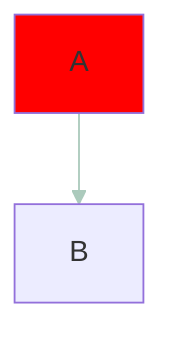

# CLAK Grafik-normalisering — Præcedens-rammeværk

> Hurtig reference for teamet: Hvad sker der når kilde-Mermaid og CLAK overlapper?
> Snapshot- og unit-tests findes i `src/design/clakVisualLanguage.test.ts`.

## Pipeline (rækkefølge)

`normalizeClakGraphic` kører altid i denne rækkefølge:

```
1. init-block          → %%{init: {theme:"base", themeVariables: …, flowchart, securityLevel}}%%
2. renset kilde        → original kilde minus style/linkStyle/inline-farver
3. CLAK classDefs      → classDef agent … ; classDef tool … ; …
4. CLAK class-bindinger → class <id> <kind>; (fra spec.classes)
```



```mermaid
flowchart LR
    A[&#91;1&#93; init-block<br/>theme + themeVariables] --> B[&#91;2&#93; Rensning af kilde]
    B --> C[&#91;3&#93; Append classDefs<br/>agent, tool, claim, …]
    C --> D[&#91;4&#93; Append class-bindinger<br/>fra spec.classes]

    style A fill:#6366f1,color:#fff,stroke:none
    style D fill:#10b981,color:#fff,stroke:none
```

**Konsekvens:** init står altid linje 1. Alt CLAK kommer efter renset kilde.

---

## Vinder-regler ved overlap

### 1. `style` / `linkStyle` linjer fra kilden

**Regel:** Fjernes helt.  
**Hvorfor:** CLAK themeVariables + classDefs styrer farver. Ingen ad-hoc overrides overlever.

**Eksempel:**



```mermaid
%% Resultat
style A …        ← fjernet
linkStyle 0 …    ← fjernet
#ff0000, #abcabc  ← ingen steder i output
```

---

### 2. Inline farver i node-syntax

**Regel:** `fill:#xxx`, `stroke:#xxx`, `color:#xxx`, `background:#xxx` strippes via regex.  
**Hvorfor:** Samme som ovenfor — CLAK classDefs vinder.

**Eksempel:**

```mermaid
%% Kilde
A[Label fill:#123456 stroke:#abcdef] --> B
```

```mermaid
%% Resultat
A[Label ] --> B   ← farver strippet, struktur bevaret
```

---

### 3. `classDef <name>` fra kilden overlapper CLAK's `classDef <name>`

**Regel:** Begge bevares. CLAK's variant appendes **efter** kildens.  
**Hvorfor:** Mermaid bruger "last definition wins".  
**Vinder:** CLAK.

**Eksempel:**

```mermaid
%% Kilde
classDef tool fill:#deadbe,stroke:#beefed;
A-->B
```

```mermaid
%% Resultat (uddrag)
classDef tool ,;                           ← kilde bevaret (farver strippet)
…
classDef tool fill:#111827,stroke:#3b82f6,… ← CLAK sidst → vinder
```

---

### 4. `class <id> <name>;` bindinger — kilde vs `spec.classes`

**Regel:** Hvis både kilde og `spec.classes` binder samme `<id>`, bevares begge og CLAK's binding appendes sidst.  
**Hvorfor:** Mermaid "last binding wins".  
**Vinder:** `spec.classes`.

**Eksempel:**

```ts
// spec.classes = { A: "agent" }
// Kilde indeholder: class A tool;
```

```mermaid
%% Resultat (uddrag)
class A tool;     ← kilde bevaret
…
class A agent;    ← CLAK sidst → vinder
```

---

### 5. Init-block fra kilden

**Regel:** Kildens `%%{init: …}%%` erstattes af CLAK's init.  
**Hvorfor:** CLAK skal sætte `theme: "base"` og `themeVariables`.  
**Vinder:** CLAK init.

---

## Opsummeringstabel

| Overlap               | Kilde     | CLAK           | Vinder | Mekanisme          |
| --------------------- | --------- | -------------- | ------ | ------------------ |
| `style` / `linkStyle` | bevaret   | —              | CLAK   | fjernet helt       |
| inline farver         | bevaret   | —              | CLAK   | strippet via regex |
| `classDef <name>`     | bevaret   | appendes efter | CLAK   | last-def-wins      |
| `class <id> <name>`   | bevaret   | appendes efter | CLAK   | last-binding-wins  |
| `%%{init}%%`          | erstattet | altid linje 1  | CLAK   | overskrives        |

---

## Sådan tilføjer du en ny classDef

1. Tilføj `kind` i `ClakNodeKind` (`src/design/clakTokens.ts`)
2. Tilføj case i `getClakNodeStyle()` (`src/design/clakVisualLanguage.ts`)
3. Tilføj mapping i `CLAK_CLASS_DEFS`
4. Opdater `classDefsBlock()` hvis logikken ændres
5. Kør tests: `bunx vitest run src/design/clakVisualLanguage.test.ts`

> **Husk:** CLAK tillader aldrig random Mermaid-farver. Alt går gennem tokens.
