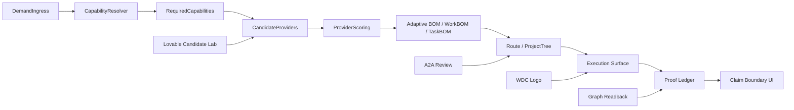

# Gemini App Frontend Toolbox Architecture

## Objective

Create a sustainable frontend architecture where external design generators,
WDC CLI evidence, graph readback, review input, and deployment evidence can be
composed as toolboxes without weakening data integrity.

The critical correction is that routing is not the first abstraction. The first
abstraction after demand capture is `CapabilityResolver`.

This slice establishes the frontend-side contracts and canonical logo. It does
not perform backend writes, graph writes, Railway mutation, claim promotion, or
runtime proof promotion.

## Toolbox Model

Each toolbox is a bounded frontend capability with explicit inputs, outputs,
authority, and failure modes. Toolboxes are selected only after the demand has
resolved into required capabilities and candidate providers have been scored.

| Toolbox | Role | Authority | Output |
| --- | --- | --- | --- |
| Brand System | Canonical WDC logo and visual constants | frontend asset | `wdcBrand`, `WdcLogo` |
| Lovable Candidate Lab | High-fidelity prototype generation | candidate only | prompt envelopes, component maps |
| Vercel Deployment Readback | Future deploy/readback UX surface | diagnostic/runtime readback only | deploy evidence cards |
| Claude Review Input | Non-blocking review and critique | review evidence only | findings, signoff, risks |
| Codex Implementation | Port selected patterns into repo | code changes | components, docs, tests |
| Graph Integrity | Render graph counts and boundaries | readback only | inspector panels |
| Runtime Proof | Show deployed SHA and replay evidence | runtime evidence only | proof ledger |
| Claim Boundary | Prevent overclaiming in UI copy | governance guard | badges and blocked states |
| Capability Resolver | Resolve demand into capability requirements | frontend candidate/readback | required capabilities |
| Provider Scoring | Rank providers by fit, proof, cost, latency, risk, compliance | frontend candidate/readback | scored provider matrix |

## Composition Pattern

## Data Integrity Contract

- Candidate prototypes are not production truth.
- Fixture counts are labeled as fixtures.
- Production counts require WDC CLI or governed graph readback.
- Runtime proof requires deployed SHA readback plus structured evidence.
- Claim promotion is never performed by the frontend.
- Review evidence is not runtime evidence.
- Deployment status is not graph proof.

## Missing Frontend Capabilities

The current app already has strong building blocks: Agent Office shell,
capability library, object cards, composition recipes, project tree, object
inspector, and world-class assessment surfaces.

The missing pieces are:

- A canonical brand asset and component.
- A candidate-intake contract for generated UI examples.
- A visual distinction between candidate, diagnostic, runtime, and claim-grade
  evidence.
- A toolbox registry that tells users which system can be trusted for which
  decision.
- A proof ledger UI that prevents deployment, review, and graph evidence from
  being collapsed into the same status.
- A repeatable porting path from Lovable/Vercel/Claude outputs into governed
  Gemini App code.
- A capability resolver model that makes route selection a downstream decision.
- Provider scoring that exposes why WDC CLI, Orbit, Lovable, Claude, Vercel,
  HarvestLine, or a materializer is selected or blocked.

## Recommended Frontend Path

1. Use `WdcLogo` and `wdcBrand` as the immediate brand foundation.
2. Add the capability resolver model and panel as the first cockpit primitive.
3. Add a read-only toolbox registry panel that displays each toolbox boundary.
4. Add candidate import cards for Lovable outputs using the intake envelope.
5. Add evidence badges: `candidate`, `diagnostic`, `runtime`, `claim`.
6. Add a proof ledger that separates PR, deploy, graph readback, EventSpine,
   and claim boundary evidence.
7. Only after those boundaries are visible, wire live readback data.

## Acceptance Criteria

- No UI route can imply runtime proof from candidate data.
- Every generated prototype has a candidate envelope.
- Every external output has source, authority, and acceptance status.
- Every proof card names its evidence class.
- Logo usage comes from the canonical asset path.
- Runtime proof remains unavailable unless deployed readback exists.
- Route selection is blocked until required capabilities are visible.
- Provider scoring includes fit, proof history, cost, latency, risk, and
  compliance.
